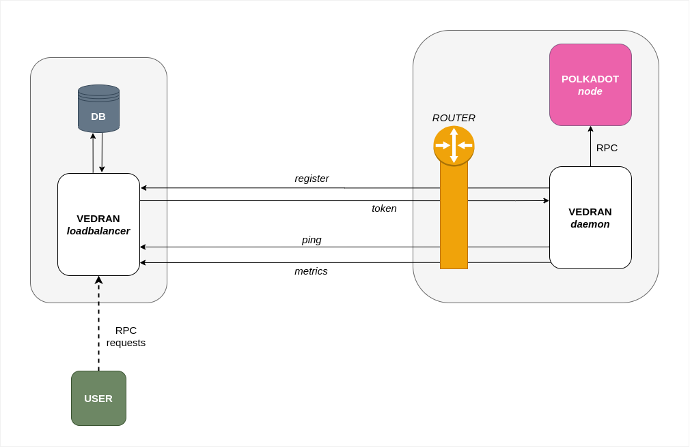

# Vedran

> Polkadot chain load balancer.

### Architecture

_Vedran loadbalancer_ is used in conjunction with [Vedran daemon](https://github.com/NodeFactoryIo/vedran-daemon). Suppose the node owner wants to register to loadbalancer, than it is required to install and run _Vedran daemon_. Daemon executes the registration process and starts providing all relevant information (ping, metrics) to the _Vedran loadbalancer_. Please check [Vedran daemon repo](https://github.com/NodeFactoryIo/vedran-daemon) for more details on the daemon itself.




## Demo

### Requirements

- Install [Docker Engine](https://docs.docker.com/engine/install/)
- Install [Docker Compose](https://docs.docker.com/compose/install/)

**Run demo with `docker-compose up`**

_After all components have been started and node has sent first valid metrics report (after 30 seconds), you can invoke RPC methods on `localhost:4000`_

This demo starts three separate dockerized components:
- _Polkadot node_ ([repository](https://github.com/paritytech/polkadot))
- _Vedran daemon_ ([repository](https://github.com/NodeFactoryIo/vedran-daemon))
- _Vedran loadbalancer_

## Get `vedran` package
1. Install [Golang](https://golang.org/doc/install) **1.13 or greater**
2. Run the command below
```
go get github.com/NodeFactoryIo/vedran
```
3. Run vedran from your Go bin directory. For linux systems it will likely be:
```
~/go/bin/vedran
```
Note that if you need to do this, you probably want to add your Go bin directory to your $PATH to make things easier!

## Starting loadbalancer

First download latest prebuilt binaries [from releases](https://github.com/NodeFactoryIo/vedran/releases) and unzip it.

Load balancer is started by invoking **start** command.

For example `./vedran start --auth-secret=supersecret`.

You can always run vedran with `--help` flag for list of all commands `vedran --help` or for list of all options for specific command `vedran start --help`.

**Load balancer will expose Polkadot RPC API on port 80 by default (can be changed using flag `--server-port`)**


**For production use certificates (e.g. https://certbot.eff.org/) should be generated and passsed via flags: `--key-file`, `--cert-file` and port changed to 443**

Start command will start application on 2 ports that need to be exposed to public:
 1. RPC entrypoint to nodes and API for nodes to register to load balancer (default: 80)
 2. http tunnel server for creating tunnels between the node and load balancer so node operators don't to have expose nodes to public network (default: 5223)


### Required flags

`--auth-secret` authentication secret used for generating tokens

### Most important flags

`--server-port` - port on which RPC API is exposed  - **DEFAULT** [80]

`--public-ip` - public IP address of loadbalancer - **DEFAULT** uses multiple services to find out public IP

`--cert-file` - SSL certification file - **DEFAULT** uses http

`--key-file` - SSL price key file - **DEFAULT** uses http

`--tunnel-port` - port on which tunnel server is listening for connect requests - **DEFAULT** [5223]

`--tunnel-port-range` - range of ports that will be used for creating tunnels - **DEFAULT** [20000:30000]

### Other flags

`--name` - public name for load balancer - **DEFAULT** autogenerated name is used

`--capacity` - maximum number of nodes allowed to connect - **DEFAULT** [-1] unlimited capacity

`--whitelist` - Comma separated list of node id-s, if provided only these nodes will be allowed to connect. This flag can't be used together with --whitelist-file flag, only one option for setting whitelisted nodes can be used - **DEFAULT** no nodes whitelisted

`--whitelist-file` - Path to file with node id-s in each line that should be whitelisted. This flag can't be used together with --whitelist flag, only one option for setting whitelisted nodes can be used - **DEFAULT** no file used

`--fee` - value between 0-1 representing fee percentage that loadbalancer will take - **DEFAULT** [0.1]

`--selection` - type of selection that is used for selecting nodes on new request, valid values are `round-robin` and `random` - **DEFAULT** [round-robin]

`--log-level` - log level (debug, info, warn, error) - **DEFAULT** [error]

`--log-file` - path to file in which logs will be saved - **DEFAULT** [stdout]

## Vedran loadbalancer API

`POST   api/v1/nodes`

Register node to loadbalancer. Body should contain details about node:

```json
{
  "id": "",
  "config_hash": "",
  "node_url": "",
  "payout_address": ""
}
```

Returns **token** used for invoking rest of API.

---

`POST   api/v1/nodes/pings`

Ping loadbalancer from node. Auth token should be in header as `X-Auth-Header`.

---

`PUT    api/v1/nodes/metrics`

Send metrics for node. Auth token should be in header as `X-Auth-Header`. Body should contain metrics as:

```json
{
  "peer_count": "",
  "best_block_height": "",
  "finalized_block_height": "",
  "ready_transaction_count": ""
}
```

## License

This project is licensed under Apache 2.0:
- Apache License, Version 2.0, ([LICENSE-APACHE](http://www.apache.org/licenses/LICENSE-2.0))
